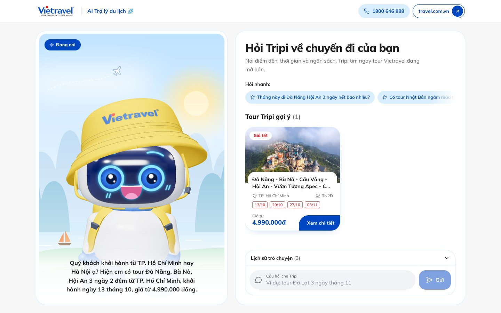

# Tripi: Trợ lý du lịch AI cho Vietravel

02/10/2026 · baoduongg

## Tổng quan

Tripi là **trợ lý du lịch AI biết nói tiếng Việt**: khách hỏi tự nhiên, Tripi trả lời bằng giọng nói, gợi ý tour thật kèm giá, ngày khởi hành và ưu đãi đang có trên travel.com.vn. Chạy ngay trên trình duyệt, điện thoại hay màn hình tại văn phòng.

Bản demo dùng **154 tour đang mở bán** lấy từ travel.com.vn ngày 02/10/2026, linh vật Tripi 3D dựng lại theo hình ảnh trên website, giao diện theo ngôn ngữ thiết kế của travel.com.vn.

## Tính năng và điểm mạnh

- **Linh vật Tripi 3D:** mũ tai bèo Vietravel, mặt LED chớp mắt, liếc nhìn, vẫy tay và nháy mắt khi chào; miệng LED mở theo giọng nói.
- **Giọng Việt chuẩn:** xưng “em”, gọi “Quý khách”; đọc giá tour, ngày khởi hành và số tổng đài như người thật.
- **Tư vấn đúng nhu cầu:** thiếu thông tin thì hỏi lại điểm đến, nơi khởi hành, thời gian hoặc ngân sách; đủ thì gợi ý tối đa 2 tour phù hợp nhất. Nhớ 10 lượt hội thoại để hiểu câu hỏi nối tiếp.
- **Thẻ tour thật:** tour được nhắc tới hiện thành thẻ gồm ảnh, dòng tour, ngày đi, giá, ưu đãi giờ chót; bấm “Xem chi tiết” mở đúng trang tour trên travel.com.vn.
- **Không bịa thông tin:** chỉ trả lời từ dữ liệu đã kiểm chứng. Phí hủy tour, thủ tục visa hay câu ngoài dữ liệu thì mời gọi tổng đài 1800 646 888.
- **Dữ liệu luôn mới:** một lệnh lấy lại toàn bộ tour, giá và lịch khởi hành từ travel.com.vn; tour đã qua ngày khởi hành tự ẩn.
- **Đồng bộ với travel.com.vn:** màu sắc, font chữ, thẻ tour và ô nhập câu hỏi theo đúng ngôn ngữ thiết kế của website; dùng tốt trên điện thoại.
- **Ổn định và an toàn:** tự thử lại khi dịch vụ AI quá tải; giọng nói lỗi vẫn hiện chữ. Khóa AI và giọng nói chỉ nằm trên máy chủ.

Hỏi bằng giọng nói qua micro đã xây xong nhưng đang tạm ẩn.

**Đặt Tripi ở đâu:** website travel.com.vn, app Vietravel, kiosk tại văn phòng, gian hàng hội chợ du lịch.
**Có thể mở rộng sang:** vé máy bay, khách sạn, combo du lịch, Vietravel MICE, tra cứu booking.

## So sánh công nghệ với Anh Hai Cà Mau

[Anh Hai Cà Mau](https://www.anhhaicamau.com/) **truy xuất video dựng sẵn**; Tripi **tạo mới** câu trả lời, giọng nói và khẩu hình cho từng câu hỏi. Quan sát qua lưu lượng mạng ngày 02/10/2026.

| Tầng công nghệ | Anh Hai Cà Mau | Tripi |
| --- | --- | --- |
| Hiểu câu hỏi | So khớp với kho câu hỏi, mỗi câu độc lập | AI Claude (Anthropic), nhớ 10 lượt hội thoại |
| Tạo câu trả lời | Chọn video gần nhất trong hàng nghìn video; không khớp thì phát video “không tìm thấy” | AI soạn mới từ 154 tour thật, kèm thẻ tour bấm được |
| Giọng nói | Gắn sẵn trong video HeyGen | Saydi TTS tổng hợp mới mỗi câu |
| Nhân vật | Video người thật dựng trước | Linh vật 3D trên trình duyệt, miệng LED khớp giọng nói |
| Dữ liệu mỗi câu trả lời | Video HLS tới 1080p qua CDN | Vài giây âm thanh mp3 |
| Độ trễ | 3-5 giây | 6 đến 7 giây |
| Cập nhật nội dung | Dựng video mới cho từng cặp hỏi đáp | Một lệnh lấy lại tour, giá, lịch khởi hành |
| Thống kê sử dụng | Có (câu hỏi, thời gian xem) | Chưa có |

- **Tripi hơn:** trả lời đúng ý cả câu hỏi mới lẫn câu nối tiếp, giá và lịch luôn khớp website, không tốn chi phí dựng video. Ví dụ: hỏi tiếp “Còn khởi hành từ Hà Nội thì sao em?”, Tripi hiểu vẫn là tour Đà Nẵng, Hội An. Còn Anh Hai Cà Mau trả lời “lúa đẻ nhánh” bằng video về trổ bông.
- **Anh Hai Cà Mau hơn:** gương mặt người thật, nội dung duyệt trước 100%, phản hồi nhanh hơn, có thống kê.
- **Hướng thu hẹp:** dựng Tripi từ file 3D gốc, rút ngắn độ trễ bằng phát giọng theo luồng, bật micro, thêm thống kê câu hỏi.

## Kịch bản demo

[▶ Xem video demo (2 phút 7 giây, có tiếng)](../recordings/demo-tripi.mp4)

Video và ảnh chụp từ một lượt chạy thật ngày 02/10/2026. Câu chữ AI trả lời có thể khác đôi chút mỗi lần, còn tour, giá và ngày đi luôn lấy từ dữ liệu.

1. **Bắt đầu trò chuyện:** bấm “Trò chuyện với Tripi”, Tripi vẫy tay, nháy mắt và chào bằng giọng nói. ([ảnh](assets/step-1.jpg))
2. **Câu hỏi nhanh:** “Tháng này đi Đà Nẵng Hội An 3 ngày hết bao nhiêu?” → tour 3 ngày 2 đêm từ 4.990.000 đồng, khởi hành 13/10, hiện thẻ tour. ([ảnh](assets/step-2.jpg))
3. **Câu hỏi nối tiếp:** “Còn khởi hành từ Hà Nội thì sao em?” → hiểu ngữ cảnh, gợi ý tour 4 ngày 3 đêm từ Hà Nội, 5.990.000 đồng. ([ảnh](assets/step-3.jpg))
4. **Ngoài dữ liệu:** “Nếu hủy tour thì có mất phí không?” → nói chưa có thông tin, đọc tổng đài 1800 646 888. ([ảnh](assets/step-4.jpg))
5. **Ngắt lời:** đang trả lời “Tour nước ngoài nào dưới 10 triệu, đi từ TP. Hồ Chí Minh?” thì hỏi “Có ưu đãi giờ chót nào khởi hành từ TP. Hồ Chí Minh không em?” → dừng ngay, hiện tour Bangkok, Pattaya giờ chót còn 7.990.000 đồng, giảm từ 8.590.000 đồng. ([ảnh](assets/step-5.jpg))

**Trước buổi demo:**

- [ ] Chạy `python3 scripts/scrape-tours.py` để lấy giá và lịch khởi hành mới nhất
- [ ] Dùng Chrome hoặc Edge, mạng ổn định, bật loa
- [ ] Khóa AI và giọng nói còn hạn mức; chạy thử trọn kịch bản một lần

## Nền tảng công nghệ

| Thành phần | Công nghệ |
| --- | --- |
| Web app | Next.js 15, React 19, Tailwind CSS 4 |
| AI hội thoại | Claude (Anthropic) |
| Giọng nói | Saydi TTS tiếng Việt |
| Linh vật Tripi 3D | Three.js, mặt LED vẽ theo âm lượng giọng nói |
| Dữ liệu tour | Lấy từ travel.com.vn bằng script Python |
| Nhận dạng giọng nói | Web Speech API (Chrome, Edge), đang tạm ẩn |

## Bước tiếp theo

Để đưa Tripi lên travel.com.vn: file 3D gốc của Tripi, nguồn dữ liệu tour chính thức thay cho việc đọc từ website, và chính sách hoàn hủy, visa để Tripi trả lời trọn vẹn hơn.

**Lưu ý:** dữ liệu tour lấy từ travel.com.vn ngày 02/10/2026, giá và chỗ thay đổi theo thời gian. Tripi trong demo dựng lại từ hình ảnh linh vật trên website.
